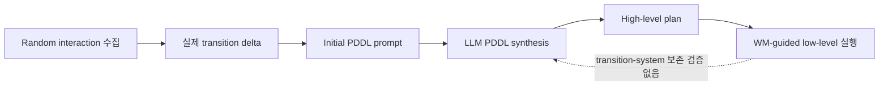
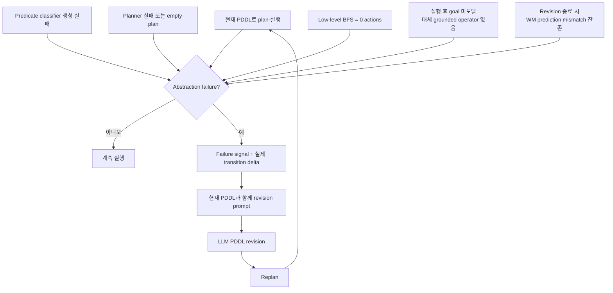
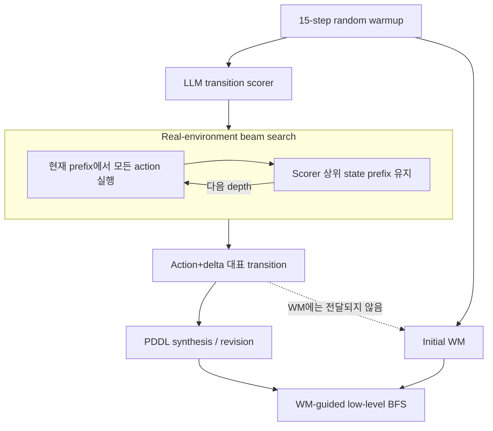

# TC2 high-level abstraction 병목 개선: v1 → v3

연구 미팅 자료 · MiniCrafter-OO L0–L7 · domain description OFF

> **핵심 결론:** 실제 transition grounding, 실패 기반 revision, LLM-guided exploration을 순차적으로 추가하면서 original solve rate는 **4/8 → 6.5/8 → 8/8**로 개선됐다. 그러나 random_chars는 **0/8 → 0/8 → 1/8**에 머물렀다. 남은 병목은 exploration 양보다 scorer·WM·PDDL이 함께 쓰는 **공유 causal theory의 부재**다.

---

## 1. 문제: domain knowledge 없이 high-level을 어떻게 복원할까?

### 기존 결과

| TC2 | Original | Random Chars | Random Words |
|---|---:|---:|---:|
| Domain description ON | 11 | 10 | 11 |
| Domain description OFF | 0 | 0 | 1 |

난이도 순서는 다음과 같다.

1. 일반 이름 + domain description
2. 일반 이름 + domain description 없음
3. 이름까지 randomization

현재 병목은 3단계 이전, 즉 **일반 이름과 description이 있어도 생성한 high-level abstraction의 실행 가능성을 보장하지 못한다**는 점이다.

### 기존 abstraction의 두 실패

- **공간 조건:** PDDL은 한 번 얻은 `(adjacent_to table)`을 이동 뒤에도 지우지 않는다. 따라서 table `(6,2)`와 furnace `(3,2)`가 떨어져 있어 실제 동시 인접이 불가능해도 계획은 가능하다고 본다. 실제 생성 domain도 `approach_table`과 `approach_furnace`가 기존 adjacency를 삭제하지 않은 채 각각 사실을 누적한다. [domain L49–58](../../../projects/tc/runs/minicrafter_naming_description_ablation_eb61be2_20260713/names_semantic/description_on/tc2/level_11/domain.pddl#L49-L58), [동시 인접 요구 L109–118](../../../projects/tc/runs/minicrafter_naming_description_ablation_eb61be2_20260713/names_semantic/description_on/tc2/level_11/domain.pddl#L109-L118)
- **재료 조건:** iron pickaxe까지 table 2 + wood pickaxe 1 + stone pickaxe 1 + iron pickaxe 1로 wood **5개**가 필요하지만, 한 생성 계획은 4개만 수집했다. PDDL plan은 성립해도 실제 iron pickaxe 단계에는 wood가 남지 않는다.
- **description도 interaction도 없을 때:** 제작법과 공간 조건을 식별할 관측 근거 자체가 없다.

즉, 병목은 “LLM이 PDDL을 쓸 수 있는가”가 아니라 **그 PDDL이 실제 transition system을 보존하는가**다.

---

## 2. 실험 설계

### 가설

| 버전 | 검증 가설 |
|---|---|
| **v1 — observational grounding** | 실제 transition delta를 조건으로 PDDL을 합성하면 mission-relevant operator의 효과를 환경에 grounding할 수 있다. |
| **v2 — failure-driven repair** | 실행 중 관측된 abstraction failure와 실제 interaction evidence로 잘못된 precondition/effect를 온라인 수정할 수 있다. |
| **v3 — goal-directed discovery** | LLM이 생성한 transition utility가 제한된 candidate budget에서 긴 prerequisite 경로와 mechanic-revealing transition을 우선 발견할 수 있다. |

### 평가 run

- 기준 경로: [`projects/tc/runs/exploration`](../../../projects/tc/runs/exploration)
- Original: seed 42, 43 평균
- Random chars: leakage 차단을 위해 **v1은 seed 42**, **v2·v3는 seed 43**만 공식 solve rate에 사용
- 제외 진단 run: v1 random_chars seed 43, v2 random_chars seed 42는 각각 8/8이지만 pretrained Crafter knowledge leakage 증거가 있음

---

## 3. v1 — 실제 transition으로 initial PDDL grounding



**핵심 차이:** raw state와 이름만으로 PDDL을 추측하지 않고, 실제 관측된 action effect를 initial synthesis에 추가했다.

### 구체적 검증

Original seed 43, L0:

1. `do`가 실제로 `ach_collect_wood: 0→1`, `inv_wood: 0→1`, tree 제거를 만든다. [PDDL prompt L330–335](../../../projects/tc/runs/exploration/v1-original-43/llm_prompts/call_0001_pddl_synth_level_0.txt#L330-L335)
2. 생성 PDDL은 이를 `collect → is_set(ach_collect_wood)`로 추상화한다. [domain L16–20](../../../projects/tc/runs/exploration/v1-original-43/level_0/domain.pddl#L16-L20)
3. 실제 실행으로 L0을 해결한다. [run log L30–38](../../../projects/tc/runs/exploration/v1-original-43/run.log#L30-L38)

다만 이는 **목표 관련 effect 하나의 grounding**이지, precondition까지 포함한 transition-system 보존 증명은 아니다. 같은 v1에서 original seed 42는 1/8, seed 43은 7/8로 분산도 크다.

### v1 결론

- 실제 transition은 PDDL effect를 grounding하는 데 유효하다.
- 그러나 관측되지 않은 precondition을 semantic name prior로 채우며, 잘못된 abstraction을 실행 중 교정하지 못한다.
- **판정: 부분 지지.**

---

## 4. v2 — abstraction failure 기반 online revision



**핵심 차이:** v1의 one-shot grounding 뒤에, 실행 실패를 high-level model의 반증으로 사용하는 revision loop를 추가했다.

### 구체적 검증

Original seed 42, L1:

1. 진입 domain의 `collect_wood`는 검증되지 않은 `close_to`를 요구한다. [entry domain L4–9](../../../projects/tc/runs/exploration/v2-original-42/level_1/domain_at_entry.pddl#L4-L9)
2. grounded BFS가 precondition을 만족하지 못해 **0 actions**를 반환한다. [run log L61–68](../../../projects/tc/runs/exploration/v2-original-42/run.log#L61-L68), [plan log L1](../../../projects/tc/runs/exploration/v2-original-42/level_1/plan_log.jsonl#L1)
3. revision prompt가 이 실패를 명시적으로 전달한다. [prompt L61–70](../../../projects/tc/runs/exploration/v2-original-42/llm_prompts/call_0007_pddl_revise_level_1.txt#L61-L70)
4. 수정본은 unsupported `close_to`와 object parameter를 제거한다. [revision response L2–14](../../../projects/tc/runs/exploration/v2-original-42/level_1/pddl_revise_events/revise_attempt_1_response.txt#L2-L14)
5. 다음 attempt에서 두 collect subplan이 실행되고 level을 해결한다. [run log L70–87](../../../projects/tc/runs/exploration/v2-original-42/run.log#L70-L87), [plan log L2](../../../projects/tc/runs/exploration/v2-original-42/level_1/plan_log.jsonl#L2)

WM도 같은 방식으로 수정된다. L2에서 네 prediction mismatch가 감지된 뒤 `wm_revise`가 achievement 증가와 terrain replacement를 보완하고, 실패하던 plan이 성공한다. [run log L116–128](../../../projects/tc/runs/exploration/v2-original-42/run.log#L116-L128), [WM revision evidence](../../../projects/tc/runs/exploration/v2-original-42/llm_prompts/call_0013_wm_revise_level_2.txt#L247-L274)

### v2 결론

- failure-conditioned evidence는 실제로 과도한 precondition과 WM mismatch를 고쳐 original을 **4/8 → 6.5/8**로 높였다.
- 단, 관측된 오류만 고칠 수 있다. random_chars에서 아직 발견하지 못한 causal chain은 revision으로 만들 수 없다.
- **판정: semantic names에서는 지지, name-invariant recovery는 실패.**

---

## 5. v3 — LLM-scored real-environment beam exploration



**핵심 차이:** random interaction을 늘리는 대신, LLM scorer가 실제 환경에서 실행한 transition을 평가해 productive prefix를 beam에 남긴다.

| 설정 | 값 |
|---|---:|
| Random warmup | 15 actions / level |
| Beam width | 3 |
| Candidate budget | ≤ 2,000 / level |
| PDDL representative budget | ≤ 200 / level |
| Depth | 고정 cap 없음; frontier 소진 또는 candidate budget에서 종료 |
| 레벨별 관측 최대 prefix depth | 2–47 actions |
| Attempts / revisions | 3 / 3 |

### 구체적 검증

Original seed 43, L6:

1. Beam candidate `#1708`은 38-action prefix 뒤 실제 `make_stone_pickaxe` transition을 발견해 score 10,000으로 선택된다. [exploration L51833–51878](../../../projects/tc/runs/exploration/v3-original-43/level_6/exploration.json#L51833-L51878)
2. 관측 effect는 wood 1, stone 1 소비와 stone pickaxe·achievement 증가다.
3. 생성 PDDL은 같은 재료 effect와 placed-table 조건을 반영한다. [domain L30–33](../../../projects/tc/runs/exploration/v3-original-43/level_6/domain.pddl#L30-L33)
4. 최종 high-level operator를 low-level 6 actions로 실행해 해결한다. [run log L335–350](../../../projects/tc/runs/exploration/v3-original-43/run.log#L335-L350)

### v3 결론

- LLM scorer는 original에서 긴 productive prefix와 abstraction-relevant transition을 찾을 수 있다.
- original 두 seed 모두 8/8이므로 feasibility 가설은 지지된다.
- random_chars 1/8이므로 transition scoring만으로 name invariance가 생긴다는 가설은 기각된다.

---

## 6. 주요 결과

### Solve rate

| 버전 | Original<br/>(seed 42, 43 평균) | Random chars<br/>(leakage-safe seed) |
|---|---:|---:|
| v1 | 4/8 | 0/8 |
| v2 | 6.5/8 | 0/8 |
| v3 | **8/8** | **1/8** |

레벨별 원자료:

| 버전 | Benchmark | Seed | L0 | L1 | L2 | L3 | L4 | L5 | L6 | L7 | 합계 |
|---|---|---:|:---:|:---:|:---:|:---:|:---:|:---:|:---:|:---:|---:|
| v1 | original | 42 | ✓ | · | · | · | · | · | · | · | 1/8 |
| v1 | original | 43 | ✓ | ✓ | ✓ | ✓ | ✓ | ✓ | · | ✓ | 7/8 |
| v1 | random_chars | **42** | · | · | · | · | · | · | · | · | 0/8 |
| v2 | original | 42 | ✓ | ✓ | ✓ | ✓ | ✓ | ✓ | ✓ | ✓ | 8/8 |
| v2 | original | 43 | ✓ | ✓ | ✓ | ✓ | · | ✓ | · | · | 5/8 |
| v2 | random_chars | **43** | · | · | · | · | · | · | · | · | 0/8 |
| v3 | original | 42 | ✓ | ✓ | ✓ | ✓ | ✓ | ✓ | ✓ | ✓ | 8/8 |
| v3 | original | 43 | ✓ | ✓ | ✓ | ✓ | ✓ | ✓ | ✓ | ✓ | 8/8 |
| v3 | random_chars | **43** | ✓ | · | · | · | · | · | · | · | 1/8 |

### Leakage 진단

| 버전 | random_chars seed 42 | random_chars seed 43 |
|---|---:|---:|
| v1 | **0/8** | 8/8 |
| v2 | 8/8 | **0/8** |
| v3 | 0/8 | **1/8** |

굵은 값만 공식 결과에 사용했다. 제외한 8/8 run은 opaque identifier와 제한된 초기 interaction만 받았는데도 생성 WM이 `xcvkpr = tree`, tool tier, table/furnace 비용과 전체 recipe chain을 직접 적었다. [v1 seed 43 WM L58–79](../../../projects/tc/runs/exploration/v1-random_chars-43/worldmodel_events/wm_v1_init/response.txt#L58-L79), [recipe L123–170](../../../projects/tc/runs/exploration/v1-random_chars-43/worldmodel_events/wm_v1_init/response.txt#L123-L170), [v2 seed 42 WM L98–113](../../../projects/tc/runs/exploration/v2-random_chars-42/worldmodel_events/wm_v1_init/response.txt#L98-L113)

이는 transition-only reconstruction이 아니라 pretrained Crafter prior가 활성화된 **semantic leakage**로 해석하는 것이 타당하다.

### v3 exploration coverage — original seed 42

원자료의 original seed 42 arm에서 candidate phase만 비교하며, 공통 15-step warmup은 제외한다.

| Metric | Random | Beam |
|---|---:|---:|
| Unique public state (level별 distinct 합) / 100 candidates | 13.52 | **16.67** |
| Distinct `(level, achievement key)` / 1,000 candidates | 3.00 | **6.97** |

원자료: [exploration_efficiency_c2000.json](../../../projects/tc/runs/llm_beamsearch/exploration_efficiency_c2000.json)

해석 범위는 **candidate 선택 효율**이다. Replay까지 포함한 실제 environment action 기준 unique-state 효율은 random 13.42, beam 3.00 / 100 actions이므로, 이 결과만으로 beam의 총 interaction cost가 더 낮다고 결론낼 수는 없다.

---

## 7. random_chars가 실패하는 이유

> 이름이 제공하던 암묵적 causal theory를 transition 데이터에서 복원하지 못하고, 발견한 지식도 scorer·WM·PDDL 사이에 일관되게 공유·유지되지 않는다.

### 1) Opaque cross-key relation을 식별하지 못한다

실제 관계는 `xcvkpr --do--> inv_tpkhxk`처럼 entity 이름과 inventory 이름이 다르다. Random-chars WM은 동일 이름의 `key → inv_<key>`만 연결하므로 이 관계를 표현하지 못하고, 관측하지 못한 `do/make`는 no-op으로 둔다. [WM L69–86](../../../projects/tc/runs/exploration/v3-random_chars-43/worldmodel_history/wm_v1.py#L69-L86), [craft no-op L124–130](../../../projects/tc/runs/exploration/v3-random_chars-43/worldmodel_history/wm_v1.py#L124-L130)

### 2) Scorer가 prerequisite의 단기 손실을 벌점으로 준다

Seed 43, L2에서 `place_zezroc`은 실제로 station achievement를 `0→1`로 만들지만 `inv_tpkhxk: 2→0` 소비 때문에 score `-32`, `selected=false`가 된다. [transition L6047–6067](../../../projects/tc/runs/exploration/v3-random_chars-43/level_2/exploration.json#L6047-L6067), [scorer weights L98–110](../../../projects/tc/runs/exploration/v3-random_chars-43/level_2/exploration_scorer.py#L98-L110)

이 level의 성공한 table placement 70건이 모두 음수 점수를 받고 하나도 선택되지 않았다. Scorer가 prerequisite graph를 모르면 자원 소비 행동을 “후퇴”로 본다.

### 3) 발견한 지식이 분리되고 rollback으로 소실된다

중요하게도 exploration 자체는 성공 transition을 찾았다. Seed 43, L1 candidate `#686`은 14-action path 끝에 `make_tpkhxk_bcwrvm`을 실제로 성공시키고 선택됐다. [exploration L12823](../../../projects/tc/runs/exploration/v3-random_chars-43/level_1/exploration.json#L12823)

하지만:

- Beam evidence는 **Action + changed delta**만 PDDL로 전달된다. Prefix와 unchanged precondition은 사라진다. [runner L715–733](../../../projects/tc/tc2/runner.py#L715-L733)
- Initial WM은 15-step warmup만 보고, 이후 revision에서도 beam evidence는 받지 않는다.
- 실행에서는 collect/place subplan부터 실패한다. [plan log L1–4](../../../projects/tc/runs/exploration/v3-random_chars-43/level_1/plan_log.jsonl#L1-L4)
- 실패한 WM/PDDL revision은 rollback되어 다음 level에 남지 않는다. Random-chars seed 43의 L1–L7 `wm_at_entry.py`는 모두 v1과 동일하다. [WM ledger](../../../projects/tc/runs/exploration/v3-random_chars-43/worldmodel_history.jsonl)

따라서 같은 action을 두고 모듈 판단이 갈린다.

| 모듈 | 판단 |
|---|---|
| Scorer | prerequisite 소비는 탐색 가치가 낮음 |
| PDDL | 관측 delta상 operator는 가능 |
| WM | `do/make` effect를 몰라 low-level 실행 불가능 |

### 4) 단순 candidate 부족만으로는 실패를 설명할 수 없다

- v3는 random_chars에서도 실제 target craft transition을 발견했다.
- 별도 seed 42 coverage 진단에서 random_chars beam은 original beam보다 더 많은 unique public state(**2,245 vs 263**)와 distinct `(level, achievement key)`(**30 vs 11**)를 발견했지만, solve는 **0/8 vs 8/8**이었다. [metric 정의·seed](../../../projects/tc/runs/llm_beamsearch/exploration_efficiency_c2000.json#L3-L10), [original totals](../../../projects/tc/runs/llm_beamsearch/exploration_efficiency_c2000.json#L63-L68), [random_chars totals](../../../projects/tc/runs/llm_beamsearch/exploration_efficiency_c2000.json#L119-L124), [solve 결과](../../../projects/tc/runs/exploration/v3-random_chars-42/results.json)
- 따라서 coverage의 **양만** 늘리는 것으로는 부족하며, 다음 관계를 세 모듈이 공유해야 한다.

```text
zezroc 존재 + inv_tpkhxk ≥ 1
    → make_tpkhxk_bcwrvm
    → inv_tpkhxk_bcwrvm +1
```

표현은 textual theory일 필요는 없지만, **prefix + before state + action + after state**에서 추출한 동일 causal theory를 scorer·WM·PDDL이 함께 사용해야 한다.

---

## 8. 결론

| 버전 | 얻은 것 | 남은 한계 |
|---|---|---|
| v1 | 실제 effect를 initial PDDL에 grounding | 잘못된 precondition을 검증·수정하지 못함 |
| v2 | 실행 실패로 PDDL/WM을 온라인 수정 | 관측하지 못한 opaque dependency는 발견 못함 |
| v3 | 긴 productive path와 유용한 transition 발견 | 발견 지식이 WM/PDDL/scorer에 공유·유지되지 않음 |

전체 결론:

1. **Original high-level 병목은 실질적으로 해소됐다:** 4/8 → 6.5/8 → 8/8.
2. **Domain randomization 문제는 아직 해결되지 않았다:** 최고 1/8.
3. 다음 실험의 최소 핵심은 더 큰 beam이 아니라, full transition context에서 prerequisite 관계를 추출해 세 모듈에 공유하고 revision을 level 간 보존하는 것이다.

---

## Appendix A. Prompt·artifact 읽는 법

공식 인덱스 대상 run:

- v1: `v1-original-42`, `v1-original-43`, `v1-random_chars-42`
- v2: `v2-original-42`, `v2-original-43`, `v2-random_chars-43`
- v3: `v3-original-42`, `v3-original-43`, `v3-random_chars-43`

Prompt 역할:

- **Exploration scorer:** `exploration_scorer`
- **PDDL:** `pddl_synth`(init), `pddl_revise`, `pddl_transfer`, `predicate_synth`
- **WM:** `wm_synth`(init), `wm_revise`

생성 파일 역할:

- **Exploration scorer:** `exploration_scorer.py`, `exploration.json`
- **PDDL:** `domain_at_entry.pddl`, `validated_domain_at_entry.pddl`, `domain.pddl`, `problem.pddl`, `predicates.py`, `pddl_revise_events/`, `plan_log.jsonl`
- **WM:** `wm_at_entry.py`, run-level `worldmodel.py`, `validated_wm.py`, `worldmodel_history.jsonl`, `worldmodel_history/`, `worldmodel_events/`
- **공통 실행 근거:** `trajectory.json`, `scale_diagnostics.json`, `run.log`, `results.json`, `llm_calls.jsonl`

> **보존 한계:** 모든 prompt는 `llm_prompts/`에 남지만 모든 중간 생성물은 남지 않는다. PDDL/scorer 파일은 retry마다 덮어쓰며, `pddl_revise_events`도 같은 level의 이전 응답을 덮어쓸 수 있다. `llm_calls.jsonl`에는 response 본문이 없다. 완전한 source snapshot history는 WM에만 존재한다. 아래 artifact 표는 **실제로 남아 있는 전체 파일 집합**을 인덱싱한다.

## Appendix B. 모든 prompt

### v1

<details>
<summary><strong>benchmark: original · seed: 42</strong> — 40 calls · <a href="../../../projects/tc/runs/exploration/v1-original-42/llm_prompts">prompt directory</a></summary>

| Level | Exploration scorer | PDDL | WM |
|---:|---|---|---|
| L0 | — | [0001 synth](../../../projects/tc/runs/exploration/v1-original-42/llm_prompts/call_0001_pddl_synth_level_0.txt) · [0003 predicate](../../../projects/tc/runs/exploration/v1-original-42/llm_prompts/call_0003_predicate_synth_level_0.txt) | [0002 synth](../../../projects/tc/runs/exploration/v1-original-42/llm_prompts/call_0002_wm_synth_level_0.txt) |
| L1 | — | [0004 revise](../../../projects/tc/runs/exploration/v1-original-42/llm_prompts/call_0004_pddl_revise_level_1.txt) · [0005 transfer](../../../projects/tc/runs/exploration/v1-original-42/llm_prompts/call_0005_pddl_transfer_level_1.txt) · [0006 predicate](../../../projects/tc/runs/exploration/v1-original-42/llm_prompts/call_0006_predicate_synth_level_1.txt) · [0007 predicate](../../../projects/tc/runs/exploration/v1-original-42/llm_prompts/call_0007_predicate_synth_level_1.txt) · [0008 predicate](../../../projects/tc/runs/exploration/v1-original-42/llm_prompts/call_0008_predicate_synth_level_1.txt) | — |
| L2 | — | [0009 revise](../../../projects/tc/runs/exploration/v1-original-42/llm_prompts/call_0009_pddl_revise_level_2.txt) · [0010 transfer](../../../projects/tc/runs/exploration/v1-original-42/llm_prompts/call_0010_pddl_transfer_level_2.txt) · [0011 predicate](../../../projects/tc/runs/exploration/v1-original-42/llm_prompts/call_0011_predicate_synth_level_2.txt) · [0013 synth](../../../projects/tc/runs/exploration/v1-original-42/llm_prompts/call_0013_pddl_synth_level_2.txt) · [0014 predicate](../../../projects/tc/runs/exploration/v1-original-42/llm_prompts/call_0014_predicate_synth_level_2.txt) · [0015 synth](../../../projects/tc/runs/exploration/v1-original-42/llm_prompts/call_0015_pddl_synth_level_2.txt) · [0016 predicate](../../../projects/tc/runs/exploration/v1-original-42/llm_prompts/call_0016_predicate_synth_level_2.txt) | [0012 revise](../../../projects/tc/runs/exploration/v1-original-42/llm_prompts/call_0012_wm_revise_level_2.txt) |
| L3 | — | [0017 revise](../../../projects/tc/runs/exploration/v1-original-42/llm_prompts/call_0017_pddl_revise_level_3.txt) · [0018 transfer](../../../projects/tc/runs/exploration/v1-original-42/llm_prompts/call_0018_pddl_transfer_level_3.txt) · [0019 predicate](../../../projects/tc/runs/exploration/v1-original-42/llm_prompts/call_0019_predicate_synth_level_3.txt) · [0021 synth](../../../projects/tc/runs/exploration/v1-original-42/llm_prompts/call_0021_pddl_synth_level_3.txt) · [0022 predicate](../../../projects/tc/runs/exploration/v1-original-42/llm_prompts/call_0022_predicate_synth_level_3.txt) · [0023 synth](../../../projects/tc/runs/exploration/v1-original-42/llm_prompts/call_0023_pddl_synth_level_3.txt) · [0024 predicate](../../../projects/tc/runs/exploration/v1-original-42/llm_prompts/call_0024_predicate_synth_level_3.txt) | [0020 revise](../../../projects/tc/runs/exploration/v1-original-42/llm_prompts/call_0020_wm_revise_level_3.txt) |
| L4 | — | [0025 revise](../../../projects/tc/runs/exploration/v1-original-42/llm_prompts/call_0025_pddl_revise_level_4.txt) · [0026 transfer](../../../projects/tc/runs/exploration/v1-original-42/llm_prompts/call_0026_pddl_transfer_level_4.txt) · [0027 predicate](../../../projects/tc/runs/exploration/v1-original-42/llm_prompts/call_0027_predicate_synth_level_4.txt) · [0029 synth](../../../projects/tc/runs/exploration/v1-original-42/llm_prompts/call_0029_pddl_synth_level_4.txt) · [0030 predicate](../../../projects/tc/runs/exploration/v1-original-42/llm_prompts/call_0030_predicate_synth_level_4.txt) · [0031 synth](../../../projects/tc/runs/exploration/v1-original-42/llm_prompts/call_0031_pddl_synth_level_4.txt) · [0032 predicate](../../../projects/tc/runs/exploration/v1-original-42/llm_prompts/call_0032_predicate_synth_level_4.txt) | [0028 revise](../../../projects/tc/runs/exploration/v1-original-42/llm_prompts/call_0028_wm_revise_level_4.txt) |
| L5 | — | [0033 revise](../../../projects/tc/runs/exploration/v1-original-42/llm_prompts/call_0033_pddl_revise_level_5.txt) · [0034 transfer](../../../projects/tc/runs/exploration/v1-original-42/llm_prompts/call_0034_pddl_transfer_level_5.txt) · [0035 predicate](../../../projects/tc/runs/exploration/v1-original-42/llm_prompts/call_0035_predicate_synth_level_5.txt) · [0037 synth](../../../projects/tc/runs/exploration/v1-original-42/llm_prompts/call_0037_pddl_synth_level_5.txt) · [0038 predicate](../../../projects/tc/runs/exploration/v1-original-42/llm_prompts/call_0038_predicate_synth_level_5.txt) · [0039 synth](../../../projects/tc/runs/exploration/v1-original-42/llm_prompts/call_0039_pddl_synth_level_5.txt) · [0040 predicate](../../../projects/tc/runs/exploration/v1-original-42/llm_prompts/call_0040_predicate_synth_level_5.txt) | [0036 revise](../../../projects/tc/runs/exploration/v1-original-42/llm_prompts/call_0036_wm_revise_level_5.txt) |
| L6 | — | — | — |
| L7 | — | — | — |

</details>

<details>
<summary><strong>benchmark: original · seed: 43</strong> — 39 calls · <a href="../../../projects/tc/runs/exploration/v1-original-43/llm_prompts">prompt directory</a></summary>

| Level | Exploration scorer | PDDL | WM |
|---:|---|---|---|
| L0 | — | [0001 synth](../../../projects/tc/runs/exploration/v1-original-43/llm_prompts/call_0001_pddl_synth_level_0.txt) · [0003 predicate](../../../projects/tc/runs/exploration/v1-original-43/llm_prompts/call_0003_predicate_synth_level_0.txt) | [0002 synth](../../../projects/tc/runs/exploration/v1-original-43/llm_prompts/call_0002_wm_synth_level_0.txt) |
| L1 | — | [0004 revise](../../../projects/tc/runs/exploration/v1-original-43/llm_prompts/call_0004_pddl_revise_level_1.txt) · [0005 transfer](../../../projects/tc/runs/exploration/v1-original-43/llm_prompts/call_0005_pddl_transfer_level_1.txt) · [0006 predicate](../../../projects/tc/runs/exploration/v1-original-43/llm_prompts/call_0006_predicate_synth_level_1.txt) | — |
| L2 | — | [0007 revise](../../../projects/tc/runs/exploration/v1-original-43/llm_prompts/call_0007_pddl_revise_level_2.txt) · [0008 transfer](../../../projects/tc/runs/exploration/v1-original-43/llm_prompts/call_0008_pddl_transfer_level_2.txt) · [0009 predicate](../../../projects/tc/runs/exploration/v1-original-43/llm_prompts/call_0009_predicate_synth_level_2.txt) · [0011 synth](../../../projects/tc/runs/exploration/v1-original-43/llm_prompts/call_0011_pddl_synth_level_2.txt) · [0012 predicate](../../../projects/tc/runs/exploration/v1-original-43/llm_prompts/call_0012_predicate_synth_level_2.txt) · [0013 synth](../../../projects/tc/runs/exploration/v1-original-43/llm_prompts/call_0013_pddl_synth_level_2.txt) · [0014 predicate](../../../projects/tc/runs/exploration/v1-original-43/llm_prompts/call_0014_predicate_synth_level_2.txt) | [0010 revise](../../../projects/tc/runs/exploration/v1-original-43/llm_prompts/call_0010_wm_revise_level_2.txt) |
| L3 | — | [0015 revise](../../../projects/tc/runs/exploration/v1-original-43/llm_prompts/call_0015_pddl_revise_level_3.txt) · [0016 transfer](../../../projects/tc/runs/exploration/v1-original-43/llm_prompts/call_0016_pddl_transfer_level_3.txt) · [0017 predicate](../../../projects/tc/runs/exploration/v1-original-43/llm_prompts/call_0017_predicate_synth_level_3.txt) | [0018 revise](../../../projects/tc/runs/exploration/v1-original-43/llm_prompts/call_0018_wm_revise_level_3.txt) |
| L4 | — | [0019 revise](../../../projects/tc/runs/exploration/v1-original-43/llm_prompts/call_0019_pddl_revise_level_4.txt) · [0020 transfer](../../../projects/tc/runs/exploration/v1-original-43/llm_prompts/call_0020_pddl_transfer_level_4.txt) · [0021 predicate](../../../projects/tc/runs/exploration/v1-original-43/llm_prompts/call_0021_predicate_synth_level_4.txt) | — |
| L5 | — | [0022 revise](../../../projects/tc/runs/exploration/v1-original-43/llm_prompts/call_0022_pddl_revise_level_5.txt) · [0023 transfer](../../../projects/tc/runs/exploration/v1-original-43/llm_prompts/call_0023_pddl_transfer_level_5.txt) · [0024 predicate](../../../projects/tc/runs/exploration/v1-original-43/llm_prompts/call_0024_predicate_synth_level_5.txt) | — |
| L6 | — | [0025 revise](../../../projects/tc/runs/exploration/v1-original-43/llm_prompts/call_0025_pddl_revise_level_6.txt) · [0026 transfer](../../../projects/tc/runs/exploration/v1-original-43/llm_prompts/call_0026_pddl_transfer_level_6.txt) · [0027 predicate](../../../projects/tc/runs/exploration/v1-original-43/llm_prompts/call_0027_predicate_synth_level_6.txt) · [0028 synth](../../../projects/tc/runs/exploration/v1-original-43/llm_prompts/call_0028_pddl_synth_level_6.txt) · [0029 predicate](../../../projects/tc/runs/exploration/v1-original-43/llm_prompts/call_0029_predicate_synth_level_6.txt) · [0030 synth](../../../projects/tc/runs/exploration/v1-original-43/llm_prompts/call_0030_pddl_synth_level_6.txt) · [0031 predicate](../../../projects/tc/runs/exploration/v1-original-43/llm_prompts/call_0031_predicate_synth_level_6.txt) | — |
| L7 | — | [0032 revise](../../../projects/tc/runs/exploration/v1-original-43/llm_prompts/call_0032_pddl_revise_level_7.txt) · [0033 transfer](../../../projects/tc/runs/exploration/v1-original-43/llm_prompts/call_0033_pddl_transfer_level_7.txt) · [0034 predicate](../../../projects/tc/runs/exploration/v1-original-43/llm_prompts/call_0034_predicate_synth_level_7.txt) · [0035 synth](../../../projects/tc/runs/exploration/v1-original-43/llm_prompts/call_0035_pddl_synth_level_7.txt) · [0036 predicate](../../../projects/tc/runs/exploration/v1-original-43/llm_prompts/call_0036_predicate_synth_level_7.txt) · [0037 synth](../../../projects/tc/runs/exploration/v1-original-43/llm_prompts/call_0037_pddl_synth_level_7.txt) · [0038 predicate](../../../projects/tc/runs/exploration/v1-original-43/llm_prompts/call_0038_predicate_synth_level_7.txt) | [0039 revise](../../../projects/tc/runs/exploration/v1-original-43/llm_prompts/call_0039_wm_revise_level_7.txt) |

</details>

<details>
<summary><strong>benchmark: random_chars · seed: 42</strong> — 40 calls · <a href="../../../projects/tc/runs/exploration/v1-random_chars-42/llm_prompts">prompt directory</a></summary>

| Level | Exploration scorer | PDDL | WM |
|---:|---|---|---|
| L0 | — | [0001 synth](../../../projects/tc/runs/exploration/v1-random_chars-42/llm_prompts/call_0001_pddl_synth_level_0.txt) · [0003 predicate](../../../projects/tc/runs/exploration/v1-random_chars-42/llm_prompts/call_0003_predicate_synth_level_0.txt) · [0004 predicate](../../../projects/tc/runs/exploration/v1-random_chars-42/llm_prompts/call_0004_predicate_synth_level_0.txt) · [0005 predicate](../../../projects/tc/runs/exploration/v1-random_chars-42/llm_prompts/call_0005_predicate_synth_level_0.txt) | [0002 synth](../../../projects/tc/runs/exploration/v1-random_chars-42/llm_prompts/call_0002_wm_synth_level_0.txt) |
| L1 | — | [0006 synth](../../../projects/tc/runs/exploration/v1-random_chars-42/llm_prompts/call_0006_pddl_synth_level_1.txt) · [0007 predicate](../../../projects/tc/runs/exploration/v1-random_chars-42/llm_prompts/call_0007_predicate_synth_level_1.txt) · [0011 predicate](../../../projects/tc/runs/exploration/v1-random_chars-42/llm_prompts/call_0011_predicate_synth_level_1.txt) · [0012 synth](../../../projects/tc/runs/exploration/v1-random_chars-42/llm_prompts/call_0012_pddl_synth_level_1.txt) · [0013 predicate](../../../projects/tc/runs/exploration/v1-random_chars-42/llm_prompts/call_0013_predicate_synth_level_1.txt) | [0008 revise](../../../projects/tc/runs/exploration/v1-random_chars-42/llm_prompts/call_0008_wm_revise_level_1.txt) · [0009 revise](../../../projects/tc/runs/exploration/v1-random_chars-42/llm_prompts/call_0009_wm_revise_level_1.txt) · [0010 revise](../../../projects/tc/runs/exploration/v1-random_chars-42/llm_prompts/call_0010_wm_revise_level_1.txt) |
| L2 | — | [0014 synth](../../../projects/tc/runs/exploration/v1-random_chars-42/llm_prompts/call_0014_pddl_synth_level_2.txt) · [0015 predicate](../../../projects/tc/runs/exploration/v1-random_chars-42/llm_prompts/call_0015_predicate_synth_level_2.txt) · [0019 predicate](../../../projects/tc/runs/exploration/v1-random_chars-42/llm_prompts/call_0019_predicate_synth_level_2.txt) · [0023 predicate](../../../projects/tc/runs/exploration/v1-random_chars-42/llm_prompts/call_0023_predicate_synth_level_2.txt) | [0016 revise](../../../projects/tc/runs/exploration/v1-random_chars-42/llm_prompts/call_0016_wm_revise_level_2.txt) · [0017 revise](../../../projects/tc/runs/exploration/v1-random_chars-42/llm_prompts/call_0017_wm_revise_level_2.txt) · [0018 revise](../../../projects/tc/runs/exploration/v1-random_chars-42/llm_prompts/call_0018_wm_revise_level_2.txt) · [0020 revise](../../../projects/tc/runs/exploration/v1-random_chars-42/llm_prompts/call_0020_wm_revise_level_2.txt) · [0021 revise](../../../projects/tc/runs/exploration/v1-random_chars-42/llm_prompts/call_0021_wm_revise_level_2.txt) · [0022 revise](../../../projects/tc/runs/exploration/v1-random_chars-42/llm_prompts/call_0022_wm_revise_level_2.txt) |
| L3 | — | [0024 synth](../../../projects/tc/runs/exploration/v1-random_chars-42/llm_prompts/call_0024_pddl_synth_level_3.txt) · [0025 predicate](../../../projects/tc/runs/exploration/v1-random_chars-42/llm_prompts/call_0025_predicate_synth_level_3.txt) · [0026 synth](../../../projects/tc/runs/exploration/v1-random_chars-42/llm_prompts/call_0026_pddl_synth_level_3.txt) · [0027 predicate](../../../projects/tc/runs/exploration/v1-random_chars-42/llm_prompts/call_0027_predicate_synth_level_3.txt) · [0028 synth](../../../projects/tc/runs/exploration/v1-random_chars-42/llm_prompts/call_0028_pddl_synth_level_3.txt) · [0029 predicate](../../../projects/tc/runs/exploration/v1-random_chars-42/llm_prompts/call_0029_predicate_synth_level_3.txt) | — |
| L4 | — | [0030 synth](../../../projects/tc/runs/exploration/v1-random_chars-42/llm_prompts/call_0030_pddl_synth_level_4.txt) · [0031 predicate](../../../projects/tc/runs/exploration/v1-random_chars-42/llm_prompts/call_0031_predicate_synth_level_4.txt) · [0032 synth](../../../projects/tc/runs/exploration/v1-random_chars-42/llm_prompts/call_0032_pddl_synth_level_4.txt) · [0033 predicate](../../../projects/tc/runs/exploration/v1-random_chars-42/llm_prompts/call_0033_predicate_synth_level_4.txt) · [0034 synth](../../../projects/tc/runs/exploration/v1-random_chars-42/llm_prompts/call_0034_pddl_synth_level_4.txt) · [0035 predicate](../../../projects/tc/runs/exploration/v1-random_chars-42/llm_prompts/call_0035_predicate_synth_level_4.txt) | — |
| L5 | — | [0036 synth](../../../projects/tc/runs/exploration/v1-random_chars-42/llm_prompts/call_0036_pddl_synth_level_5.txt) · [0037 predicate](../../../projects/tc/runs/exploration/v1-random_chars-42/llm_prompts/call_0037_predicate_synth_level_5.txt) · [0038 synth](../../../projects/tc/runs/exploration/v1-random_chars-42/llm_prompts/call_0038_pddl_synth_level_5.txt) · [0039 predicate](../../../projects/tc/runs/exploration/v1-random_chars-42/llm_prompts/call_0039_predicate_synth_level_5.txt) · [0040 synth](../../../projects/tc/runs/exploration/v1-random_chars-42/llm_prompts/call_0040_pddl_synth_level_5.txt) | — |
| L6 | — | — | — |
| L7 | — | — | — |

</details>

### v2

<details>
<summary><strong>benchmark: original · seed: 42</strong> — 28 calls · <a href="../../../projects/tc/runs/exploration/v2-original-42/llm_prompts">prompt directory</a></summary>

| Level | Exploration scorer | PDDL | WM |
|---:|---|---|---|
| L0 | — | [0001 synth](../../../projects/tc/runs/exploration/v2-original-42/llm_prompts/call_0001_pddl_synth_level_0.txt) · [0003 predicate](../../../projects/tc/runs/exploration/v2-original-42/llm_prompts/call_0003_predicate_synth_level_0.txt) | [0002 synth](../../../projects/tc/runs/exploration/v2-original-42/llm_prompts/call_0002_wm_synth_level_0.txt) |
| L1 | — | [0004 revise](../../../projects/tc/runs/exploration/v2-original-42/llm_prompts/call_0004_pddl_revise_level_1.txt) · [0005 transfer](../../../projects/tc/runs/exploration/v2-original-42/llm_prompts/call_0005_pddl_transfer_level_1.txt) · [0006 predicate](../../../projects/tc/runs/exploration/v2-original-42/llm_prompts/call_0006_predicate_synth_level_1.txt) · [0007 revise](../../../projects/tc/runs/exploration/v2-original-42/llm_prompts/call_0007_pddl_revise_level_1.txt) · [0008 transfer](../../../projects/tc/runs/exploration/v2-original-42/llm_prompts/call_0008_pddl_transfer_level_1.txt) · [0009 predicate](../../../projects/tc/runs/exploration/v2-original-42/llm_prompts/call_0009_predicate_synth_level_1.txt) | — |
| L2 | — | [0010 revise](../../../projects/tc/runs/exploration/v2-original-42/llm_prompts/call_0010_pddl_revise_level_2.txt) · [0011 transfer](../../../projects/tc/runs/exploration/v2-original-42/llm_prompts/call_0011_pddl_transfer_level_2.txt) · [0012 predicate](../../../projects/tc/runs/exploration/v2-original-42/llm_prompts/call_0012_predicate_synth_level_2.txt) | [0013 revise](../../../projects/tc/runs/exploration/v2-original-42/llm_prompts/call_0013_wm_revise_level_2.txt) |
| L3 | — | [0014 revise](../../../projects/tc/runs/exploration/v2-original-42/llm_prompts/call_0014_pddl_revise_level_3.txt) · [0015 transfer](../../../projects/tc/runs/exploration/v2-original-42/llm_prompts/call_0015_pddl_transfer_level_3.txt) · [0016 predicate](../../../projects/tc/runs/exploration/v2-original-42/llm_prompts/call_0016_predicate_synth_level_3.txt) | — |
| L4 | — | [0017 revise](../../../projects/tc/runs/exploration/v2-original-42/llm_prompts/call_0017_pddl_revise_level_4.txt) · [0018 transfer](../../../projects/tc/runs/exploration/v2-original-42/llm_prompts/call_0018_pddl_transfer_level_4.txt) · [0019 predicate](../../../projects/tc/runs/exploration/v2-original-42/llm_prompts/call_0019_predicate_synth_level_4.txt) | — |
| L5 | — | [0020 revise](../../../projects/tc/runs/exploration/v2-original-42/llm_prompts/call_0020_pddl_revise_level_5.txt) · [0021 transfer](../../../projects/tc/runs/exploration/v2-original-42/llm_prompts/call_0021_pddl_transfer_level_5.txt) · [0022 predicate](../../../projects/tc/runs/exploration/v2-original-42/llm_prompts/call_0022_predicate_synth_level_5.txt) | — |
| L6 | — | [0023 revise](../../../projects/tc/runs/exploration/v2-original-42/llm_prompts/call_0023_pddl_revise_level_6.txt) · [0024 transfer](../../../projects/tc/runs/exploration/v2-original-42/llm_prompts/call_0024_pddl_transfer_level_6.txt) · [0025 predicate](../../../projects/tc/runs/exploration/v2-original-42/llm_prompts/call_0025_predicate_synth_level_6.txt) | — |
| L7 | — | [0026 revise](../../../projects/tc/runs/exploration/v2-original-42/llm_prompts/call_0026_pddl_revise_level_7.txt) · [0027 transfer](../../../projects/tc/runs/exploration/v2-original-42/llm_prompts/call_0027_pddl_transfer_level_7.txt) · [0028 predicate](../../../projects/tc/runs/exploration/v2-original-42/llm_prompts/call_0028_predicate_synth_level_7.txt) | — |

</details>

<details>
<summary><strong>benchmark: original · seed: 43</strong> — 40 calls · <a href="../../../projects/tc/runs/exploration/v2-original-43/llm_prompts">prompt directory</a></summary>

| Level | Exploration scorer | PDDL | WM |
|---:|---|---|---|
| L0 | — | [0001 synth](../../../projects/tc/runs/exploration/v2-original-43/llm_prompts/call_0001_pddl_synth_level_0.txt) · [0003 predicate](../../../projects/tc/runs/exploration/v2-original-43/llm_prompts/call_0003_predicate_synth_level_0.txt) | [0002 synth](../../../projects/tc/runs/exploration/v2-original-43/llm_prompts/call_0002_wm_synth_level_0.txt) |
| L1 | — | [0004 revise](../../../projects/tc/runs/exploration/v2-original-43/llm_prompts/call_0004_pddl_revise_level_1.txt) · [0005 transfer](../../../projects/tc/runs/exploration/v2-original-43/llm_prompts/call_0005_pddl_transfer_level_1.txt) · [0006 predicate](../../../projects/tc/runs/exploration/v2-original-43/llm_prompts/call_0006_predicate_synth_level_1.txt) · [0007 revise](../../../projects/tc/runs/exploration/v2-original-43/llm_prompts/call_0007_pddl_revise_level_1.txt) · [0008 transfer](../../../projects/tc/runs/exploration/v2-original-43/llm_prompts/call_0008_pddl_transfer_level_1.txt) · [0009 predicate](../../../projects/tc/runs/exploration/v2-original-43/llm_prompts/call_0009_predicate_synth_level_1.txt) | — |
| L2 | — | [0010 revise](../../../projects/tc/runs/exploration/v2-original-43/llm_prompts/call_0010_pddl_revise_level_2.txt) · [0011 transfer](../../../projects/tc/runs/exploration/v2-original-43/llm_prompts/call_0011_pddl_transfer_level_2.txt) · [0012 predicate](../../../projects/tc/runs/exploration/v2-original-43/llm_prompts/call_0012_predicate_synth_level_2.txt) | — |
| L3 | — | [0013 revise](../../../projects/tc/runs/exploration/v2-original-43/llm_prompts/call_0013_pddl_revise_level_3.txt) · [0014 transfer](../../../projects/tc/runs/exploration/v2-original-43/llm_prompts/call_0014_pddl_transfer_level_3.txt) · [0015 predicate](../../../projects/tc/runs/exploration/v2-original-43/llm_prompts/call_0015_predicate_synth_level_3.txt) | — |
| L4 | — | [0016 revise](../../../projects/tc/runs/exploration/v2-original-43/llm_prompts/call_0016_pddl_revise_level_4.txt) · [0017 transfer](../../../projects/tc/runs/exploration/v2-original-43/llm_prompts/call_0017_pddl_transfer_level_4.txt) · [0018 predicate](../../../projects/tc/runs/exploration/v2-original-43/llm_prompts/call_0018_predicate_synth_level_4.txt) · [0019 predicate](../../../projects/tc/runs/exploration/v2-original-43/llm_prompts/call_0019_predicate_synth_level_4.txt) · [0021 revise](../../../projects/tc/runs/exploration/v2-original-43/llm_prompts/call_0021_pddl_revise_level_4.txt) · [0022 transfer](../../../projects/tc/runs/exploration/v2-original-43/llm_prompts/call_0022_pddl_transfer_level_4.txt) · [0023 predicate](../../../projects/tc/runs/exploration/v2-original-43/llm_prompts/call_0023_predicate_synth_level_4.txt) · [0024 revise](../../../projects/tc/runs/exploration/v2-original-43/llm_prompts/call_0024_pddl_revise_level_4.txt) · [0025 transfer](../../../projects/tc/runs/exploration/v2-original-43/llm_prompts/call_0025_pddl_transfer_level_4.txt) | [0020 revise](../../../projects/tc/runs/exploration/v2-original-43/llm_prompts/call_0020_wm_revise_level_4.txt) |
| L5 | — | [0026 revise](../../../projects/tc/runs/exploration/v2-original-43/llm_prompts/call_0026_pddl_revise_level_5.txt) · [0027 transfer](../../../projects/tc/runs/exploration/v2-original-43/llm_prompts/call_0027_pddl_transfer_level_5.txt) · [0028 predicate](../../../projects/tc/runs/exploration/v2-original-43/llm_prompts/call_0028_predicate_synth_level_5.txt) | [0029 revise](../../../projects/tc/runs/exploration/v2-original-43/llm_prompts/call_0029_wm_revise_level_5.txt) |
| L6 | — | [0030 revise](../../../projects/tc/runs/exploration/v2-original-43/llm_prompts/call_0030_pddl_revise_level_6.txt) · [0031 transfer](../../../projects/tc/runs/exploration/v2-original-43/llm_prompts/call_0031_pddl_transfer_level_6.txt) · [0032 predicate](../../../projects/tc/runs/exploration/v2-original-43/llm_prompts/call_0032_predicate_synth_level_6.txt) · [0034 revise](../../../projects/tc/runs/exploration/v2-original-43/llm_prompts/call_0034_pddl_revise_level_6.txt) · [0035 transfer](../../../projects/tc/runs/exploration/v2-original-43/llm_prompts/call_0035_pddl_transfer_level_6.txt) · [0036 predicate](../../../projects/tc/runs/exploration/v2-original-43/llm_prompts/call_0036_predicate_synth_level_6.txt) · [0037 revise](../../../projects/tc/runs/exploration/v2-original-43/llm_prompts/call_0037_pddl_revise_level_6.txt) · [0038 transfer](../../../projects/tc/runs/exploration/v2-original-43/llm_prompts/call_0038_pddl_transfer_level_6.txt) · [0039 predicate](../../../projects/tc/runs/exploration/v2-original-43/llm_prompts/call_0039_predicate_synth_level_6.txt) | [0033 revise](../../../projects/tc/runs/exploration/v2-original-43/llm_prompts/call_0033_wm_revise_level_6.txt) |
| L7 | — | [0040 revise](../../../projects/tc/runs/exploration/v2-original-43/llm_prompts/call_0040_pddl_revise_level_7.txt) | — |

</details>

<details>
<summary><strong>benchmark: random_chars · seed: 43</strong> — 40 calls · <a href="../../../projects/tc/runs/exploration/v2-random_chars-43/llm_prompts">prompt directory</a></summary>

| Level | Exploration scorer | PDDL | WM |
|---:|---|---|---|
| L0 | — | [0001 synth](../../../projects/tc/runs/exploration/v2-random_chars-43/llm_prompts/call_0001_pddl_synth_level_0.txt) · [0003 predicate](../../../projects/tc/runs/exploration/v2-random_chars-43/llm_prompts/call_0003_predicate_synth_level_0.txt) · [0005 revise](../../../projects/tc/runs/exploration/v2-random_chars-43/llm_prompts/call_0005_pddl_revise_level_0.txt) · [0006 transfer](../../../projects/tc/runs/exploration/v2-random_chars-43/llm_prompts/call_0006_pddl_transfer_level_0.txt) · [0007 predicate](../../../projects/tc/runs/exploration/v2-random_chars-43/llm_prompts/call_0007_predicate_synth_level_0.txt) · [0008 revise](../../../projects/tc/runs/exploration/v2-random_chars-43/llm_prompts/call_0008_pddl_revise_level_0.txt) · [0009 transfer](../../../projects/tc/runs/exploration/v2-random_chars-43/llm_prompts/call_0009_pddl_transfer_level_0.txt) · [0010 predicate](../../../projects/tc/runs/exploration/v2-random_chars-43/llm_prompts/call_0010_predicate_synth_level_0.txt) | [0002 synth](../../../projects/tc/runs/exploration/v2-random_chars-43/llm_prompts/call_0002_wm_synth_level_0.txt) · [0004 revise](../../../projects/tc/runs/exploration/v2-random_chars-43/llm_prompts/call_0004_wm_revise_level_0.txt) |
| L1 | — | [0011 synth](../../../projects/tc/runs/exploration/v2-random_chars-43/llm_prompts/call_0011_pddl_synth_level_1.txt) · [0012 predicate](../../../projects/tc/runs/exploration/v2-random_chars-43/llm_prompts/call_0012_predicate_synth_level_1.txt) · [0014 revise](../../../projects/tc/runs/exploration/v2-random_chars-43/llm_prompts/call_0014_pddl_revise_level_1.txt) · [0015 transfer](../../../projects/tc/runs/exploration/v2-random_chars-43/llm_prompts/call_0015_pddl_transfer_level_1.txt) · [0016 predicate](../../../projects/tc/runs/exploration/v2-random_chars-43/llm_prompts/call_0016_predicate_synth_level_1.txt) · [0017 revise](../../../projects/tc/runs/exploration/v2-random_chars-43/llm_prompts/call_0017_pddl_revise_level_1.txt) · [0018 transfer](../../../projects/tc/runs/exploration/v2-random_chars-43/llm_prompts/call_0018_pddl_transfer_level_1.txt) · [0019 predicate](../../../projects/tc/runs/exploration/v2-random_chars-43/llm_prompts/call_0019_predicate_synth_level_1.txt) · [0020 revise](../../../projects/tc/runs/exploration/v2-random_chars-43/llm_prompts/call_0020_pddl_revise_level_1.txt) | [0013 revise](../../../projects/tc/runs/exploration/v2-random_chars-43/llm_prompts/call_0013_wm_revise_level_1.txt) |
| L2 | — | [0021 synth](../../../projects/tc/runs/exploration/v2-random_chars-43/llm_prompts/call_0021_pddl_synth_level_2.txt) · [0022 predicate](../../../projects/tc/runs/exploration/v2-random_chars-43/llm_prompts/call_0022_predicate_synth_level_2.txt) · [0023 revise](../../../projects/tc/runs/exploration/v2-random_chars-43/llm_prompts/call_0023_pddl_revise_level_2.txt) · [0024 transfer](../../../projects/tc/runs/exploration/v2-random_chars-43/llm_prompts/call_0024_pddl_transfer_level_2.txt) · [0025 predicate](../../../projects/tc/runs/exploration/v2-random_chars-43/llm_prompts/call_0025_predicate_synth_level_2.txt) · [0026 revise](../../../projects/tc/runs/exploration/v2-random_chars-43/llm_prompts/call_0026_pddl_revise_level_2.txt) · [0027 transfer](../../../projects/tc/runs/exploration/v2-random_chars-43/llm_prompts/call_0027_pddl_transfer_level_2.txt) · [0028 predicate](../../../projects/tc/runs/exploration/v2-random_chars-43/llm_prompts/call_0028_predicate_synth_level_2.txt) · [0029 revise](../../../projects/tc/runs/exploration/v2-random_chars-43/llm_prompts/call_0029_pddl_revise_level_2.txt) · [0030 transfer](../../../projects/tc/runs/exploration/v2-random_chars-43/llm_prompts/call_0030_pddl_transfer_level_2.txt) | — |
| L3 | — | [0031 synth](../../../projects/tc/runs/exploration/v2-random_chars-43/llm_prompts/call_0031_pddl_synth_level_3.txt) · [0032 predicate](../../../projects/tc/runs/exploration/v2-random_chars-43/llm_prompts/call_0032_predicate_synth_level_3.txt) · [0033 revise](../../../projects/tc/runs/exploration/v2-random_chars-43/llm_prompts/call_0033_pddl_revise_level_3.txt) · [0034 transfer](../../../projects/tc/runs/exploration/v2-random_chars-43/llm_prompts/call_0034_pddl_transfer_level_3.txt) · [0035 predicate](../../../projects/tc/runs/exploration/v2-random_chars-43/llm_prompts/call_0035_predicate_synth_level_3.txt) · [0036 revise](../../../projects/tc/runs/exploration/v2-random_chars-43/llm_prompts/call_0036_pddl_revise_level_3.txt) · [0037 transfer](../../../projects/tc/runs/exploration/v2-random_chars-43/llm_prompts/call_0037_pddl_transfer_level_3.txt) · [0038 predicate](../../../projects/tc/runs/exploration/v2-random_chars-43/llm_prompts/call_0038_predicate_synth_level_3.txt) · [0039 revise](../../../projects/tc/runs/exploration/v2-random_chars-43/llm_prompts/call_0039_pddl_revise_level_3.txt) · [0040 transfer](../../../projects/tc/runs/exploration/v2-random_chars-43/llm_prompts/call_0040_pddl_transfer_level_3.txt) | — |
| L4 | — | — | — |
| L5 | — | — | — |
| L6 | — | — | — |
| L7 | — | — | — |

</details>

### v3

<details>
<summary><strong>benchmark: original · seed: 42</strong> — 37 calls · <a href="../../../projects/tc/runs/exploration/v3-original-42/llm_prompts">prompt directory</a></summary>

| Level | Exploration scorer | PDDL | WM |
|---:|---|---|---|
| L0 | [0002 scorer](../../../projects/tc/runs/exploration/v3-original-42/llm_prompts/call_0002_exploration_scorer_level_0.txt) | [0003 synth](../../../projects/tc/runs/exploration/v3-original-42/llm_prompts/call_0003_pddl_synth_level_0.txt) · [0004 predicate](../../../projects/tc/runs/exploration/v3-original-42/llm_prompts/call_0004_predicate_synth_level_0.txt) | [0001 synth](../../../projects/tc/runs/exploration/v3-original-42/llm_prompts/call_0001_wm_synth_level_0.txt) |
| L1 | [0005 scorer](../../../projects/tc/runs/exploration/v3-original-42/llm_prompts/call_0005_exploration_scorer_level_1.txt) | [0006 revise](../../../projects/tc/runs/exploration/v3-original-42/llm_prompts/call_0006_pddl_revise_level_1.txt) · [0007 transfer](../../../projects/tc/runs/exploration/v3-original-42/llm_prompts/call_0007_pddl_transfer_level_1.txt) · [0008 predicate](../../../projects/tc/runs/exploration/v3-original-42/llm_prompts/call_0008_predicate_synth_level_1.txt) | — |
| L2 | [0009 scorer](../../../projects/tc/runs/exploration/v3-original-42/llm_prompts/call_0009_exploration_scorer_level_2.txt) | [0010 revise](../../../projects/tc/runs/exploration/v3-original-42/llm_prompts/call_0010_pddl_revise_level_2.txt) · [0011 transfer](../../../projects/tc/runs/exploration/v3-original-42/llm_prompts/call_0011_pddl_transfer_level_2.txt) · [0012 predicate](../../../projects/tc/runs/exploration/v3-original-42/llm_prompts/call_0012_predicate_synth_level_2.txt) · [0013 revise](../../../projects/tc/runs/exploration/v3-original-42/llm_prompts/call_0013_pddl_revise_level_2.txt) · [0014 transfer](../../../projects/tc/runs/exploration/v3-original-42/llm_prompts/call_0014_pddl_transfer_level_2.txt) · [0015 predicate](../../../projects/tc/runs/exploration/v3-original-42/llm_prompts/call_0015_predicate_synth_level_2.txt) | — |
| L3 | [0016 scorer](../../../projects/tc/runs/exploration/v3-original-42/llm_prompts/call_0016_exploration_scorer_level_3.txt) | [0017 revise](../../../projects/tc/runs/exploration/v3-original-42/llm_prompts/call_0017_pddl_revise_level_3.txt) · [0018 transfer](../../../projects/tc/runs/exploration/v3-original-42/llm_prompts/call_0018_pddl_transfer_level_3.txt) · [0019 predicate](../../../projects/tc/runs/exploration/v3-original-42/llm_prompts/call_0019_predicate_synth_level_3.txt) | — |
| L4 | [0020 scorer](../../../projects/tc/runs/exploration/v3-original-42/llm_prompts/call_0020_exploration_scorer_level_4.txt) | [0021 revise](../../../projects/tc/runs/exploration/v3-original-42/llm_prompts/call_0021_pddl_revise_level_4.txt) · [0022 transfer](../../../projects/tc/runs/exploration/v3-original-42/llm_prompts/call_0022_pddl_transfer_level_4.txt) · [0023 predicate](../../../projects/tc/runs/exploration/v3-original-42/llm_prompts/call_0023_predicate_synth_level_4.txt) | — |
| L5 | [0024 scorer](../../../projects/tc/runs/exploration/v3-original-42/llm_prompts/call_0024_exploration_scorer_level_5.txt) | [0025 revise](../../../projects/tc/runs/exploration/v3-original-42/llm_prompts/call_0025_pddl_revise_level_5.txt) · [0026 transfer](../../../projects/tc/runs/exploration/v3-original-42/llm_prompts/call_0026_pddl_transfer_level_5.txt) · [0027 predicate](../../../projects/tc/runs/exploration/v3-original-42/llm_prompts/call_0027_predicate_synth_level_5.txt) | [0028 revise](../../../projects/tc/runs/exploration/v3-original-42/llm_prompts/call_0028_wm_revise_level_5.txt) · [0029 revise](../../../projects/tc/runs/exploration/v3-original-42/llm_prompts/call_0029_wm_revise_level_5.txt) |
| L6 | [0030 scorer](../../../projects/tc/runs/exploration/v3-original-42/llm_prompts/call_0030_exploration_scorer_level_6.txt) | [0031 revise](../../../projects/tc/runs/exploration/v3-original-42/llm_prompts/call_0031_pddl_revise_level_6.txt) · [0032 transfer](../../../projects/tc/runs/exploration/v3-original-42/llm_prompts/call_0032_pddl_transfer_level_6.txt) · [0033 predicate](../../../projects/tc/runs/exploration/v3-original-42/llm_prompts/call_0033_predicate_synth_level_6.txt) | — |
| L7 | [0034 scorer](../../../projects/tc/runs/exploration/v3-original-42/llm_prompts/call_0034_exploration_scorer_level_7.txt) | [0035 revise](../../../projects/tc/runs/exploration/v3-original-42/llm_prompts/call_0035_pddl_revise_level_7.txt) · [0036 transfer](../../../projects/tc/runs/exploration/v3-original-42/llm_prompts/call_0036_pddl_transfer_level_7.txt) · [0037 predicate](../../../projects/tc/runs/exploration/v3-original-42/llm_prompts/call_0037_predicate_synth_level_7.txt) | — |

</details>

<details>
<summary><strong>benchmark: original · seed: 43</strong> — 44 calls · <a href="../../../projects/tc/runs/exploration/v3-original-43/llm_prompts">prompt directory</a></summary>

| Level | Exploration scorer | PDDL | WM |
|---:|---|---|---|
| L0 | [0002 scorer](../../../projects/tc/runs/exploration/v3-original-43/llm_prompts/call_0002_exploration_scorer_level_0.txt) | [0003 synth](../../../projects/tc/runs/exploration/v3-original-43/llm_prompts/call_0003_pddl_synth_level_0.txt) · [0004 predicate](../../../projects/tc/runs/exploration/v3-original-43/llm_prompts/call_0004_predicate_synth_level_0.txt) | [0001 synth](../../../projects/tc/runs/exploration/v3-original-43/llm_prompts/call_0001_wm_synth_level_0.txt) |
| L1 | [0005 scorer](../../../projects/tc/runs/exploration/v3-original-43/llm_prompts/call_0005_exploration_scorer_level_1.txt) | [0006 revise](../../../projects/tc/runs/exploration/v3-original-43/llm_prompts/call_0006_pddl_revise_level_1.txt) · [0007 transfer](../../../projects/tc/runs/exploration/v3-original-43/llm_prompts/call_0007_pddl_transfer_level_1.txt) · [0008 predicate](../../../projects/tc/runs/exploration/v3-original-43/llm_prompts/call_0008_predicate_synth_level_1.txt) · [0010 revise](../../../projects/tc/runs/exploration/v3-original-43/llm_prompts/call_0010_pddl_revise_level_1.txt) · [0011 transfer](../../../projects/tc/runs/exploration/v3-original-43/llm_prompts/call_0011_pddl_transfer_level_1.txt) · [0012 predicate](../../../projects/tc/runs/exploration/v3-original-43/llm_prompts/call_0012_predicate_synth_level_1.txt) | [0009 revise](../../../projects/tc/runs/exploration/v3-original-43/llm_prompts/call_0009_wm_revise_level_1.txt) |
| L2 | [0013 scorer](../../../projects/tc/runs/exploration/v3-original-43/llm_prompts/call_0013_exploration_scorer_level_2.txt) | [0014 revise](../../../projects/tc/runs/exploration/v3-original-43/llm_prompts/call_0014_pddl_revise_level_2.txt) · [0015 transfer](../../../projects/tc/runs/exploration/v3-original-43/llm_prompts/call_0015_pddl_transfer_level_2.txt) · [0016 predicate](../../../projects/tc/runs/exploration/v3-original-43/llm_prompts/call_0016_predicate_synth_level_2.txt) · [0017 revise](../../../projects/tc/runs/exploration/v3-original-43/llm_prompts/call_0017_pddl_revise_level_2.txt) · [0018 transfer](../../../projects/tc/runs/exploration/v3-original-43/llm_prompts/call_0018_pddl_transfer_level_2.txt) · [0019 predicate](../../../projects/tc/runs/exploration/v3-original-43/llm_prompts/call_0019_predicate_synth_level_2.txt) · [0020 revise](../../../projects/tc/runs/exploration/v3-original-43/llm_prompts/call_0020_pddl_revise_level_2.txt) · [0021 transfer](../../../projects/tc/runs/exploration/v3-original-43/llm_prompts/call_0021_pddl_transfer_level_2.txt) · [0022 predicate](../../../projects/tc/runs/exploration/v3-original-43/llm_prompts/call_0022_predicate_synth_level_2.txt) | [0023 revise](../../../projects/tc/runs/exploration/v3-original-43/llm_prompts/call_0023_wm_revise_level_2.txt) |
| L3 | [0024 scorer](../../../projects/tc/runs/exploration/v3-original-43/llm_prompts/call_0024_exploration_scorer_level_3.txt) | [0025 revise](../../../projects/tc/runs/exploration/v3-original-43/llm_prompts/call_0025_pddl_revise_level_3.txt) · [0026 transfer](../../../projects/tc/runs/exploration/v3-original-43/llm_prompts/call_0026_pddl_transfer_level_3.txt) · [0027 predicate](../../../projects/tc/runs/exploration/v3-original-43/llm_prompts/call_0027_predicate_synth_level_3.txt) | [0028 revise](../../../projects/tc/runs/exploration/v3-original-43/llm_prompts/call_0028_wm_revise_level_3.txt) |
| L4 | [0029 scorer](../../../projects/tc/runs/exploration/v3-original-43/llm_prompts/call_0029_exploration_scorer_level_4.txt) | [0030 revise](../../../projects/tc/runs/exploration/v3-original-43/llm_prompts/call_0030_pddl_revise_level_4.txt) · [0031 transfer](../../../projects/tc/runs/exploration/v3-original-43/llm_prompts/call_0031_pddl_transfer_level_4.txt) · [0032 predicate](../../../projects/tc/runs/exploration/v3-original-43/llm_prompts/call_0032_predicate_synth_level_4.txt) | — |
| L5 | [0033 scorer](../../../projects/tc/runs/exploration/v3-original-43/llm_prompts/call_0033_exploration_scorer_level_5.txt) | [0034 revise](../../../projects/tc/runs/exploration/v3-original-43/llm_prompts/call_0034_pddl_revise_level_5.txt) · [0035 transfer](../../../projects/tc/runs/exploration/v3-original-43/llm_prompts/call_0035_pddl_transfer_level_5.txt) · [0036 predicate](../../../projects/tc/runs/exploration/v3-original-43/llm_prompts/call_0036_predicate_synth_level_5.txt) | — |
| L6 | [0037 scorer](../../../projects/tc/runs/exploration/v3-original-43/llm_prompts/call_0037_exploration_scorer_level_6.txt) | [0038 revise](../../../projects/tc/runs/exploration/v3-original-43/llm_prompts/call_0038_pddl_revise_level_6.txt) · [0039 transfer](../../../projects/tc/runs/exploration/v3-original-43/llm_prompts/call_0039_pddl_transfer_level_6.txt) · [0040 predicate](../../../projects/tc/runs/exploration/v3-original-43/llm_prompts/call_0040_predicate_synth_level_6.txt) | — |
| L7 | [0041 scorer](../../../projects/tc/runs/exploration/v3-original-43/llm_prompts/call_0041_exploration_scorer_level_7.txt) | [0042 revise](../../../projects/tc/runs/exploration/v3-original-43/llm_prompts/call_0042_pddl_revise_level_7.txt) · [0043 transfer](../../../projects/tc/runs/exploration/v3-original-43/llm_prompts/call_0043_pddl_transfer_level_7.txt) · [0044 predicate](../../../projects/tc/runs/exploration/v3-original-43/llm_prompts/call_0044_predicate_synth_level_7.txt) | — |

</details>

<details>
<summary><strong>benchmark: random_chars · seed: 43</strong> — 100 calls · <a href="../../../projects/tc/runs/exploration/v3-random_chars-43/llm_prompts">prompt directory</a></summary>

| Level | Exploration scorer | PDDL | WM |
|---:|---|---|---|
| L0 | [0002 scorer](../../../projects/tc/runs/exploration/v3-random_chars-43/llm_prompts/call_0002_exploration_scorer_level_0.txt) | [0003 synth](../../../projects/tc/runs/exploration/v3-random_chars-43/llm_prompts/call_0003_pddl_synth_level_0.txt) · [0004 predicate](../../../projects/tc/runs/exploration/v3-random_chars-43/llm_prompts/call_0004_predicate_synth_level_0.txt) | [0001 synth](../../../projects/tc/runs/exploration/v3-random_chars-43/llm_prompts/call_0001_wm_synth_level_0.txt) |
| L1 | [0005 scorer](../../../projects/tc/runs/exploration/v3-random_chars-43/llm_prompts/call_0005_exploration_scorer_level_1.txt) | [0006 revise](../../../projects/tc/runs/exploration/v3-random_chars-43/llm_prompts/call_0006_pddl_revise_level_1.txt) · [0007 transfer](../../../projects/tc/runs/exploration/v3-random_chars-43/llm_prompts/call_0007_pddl_transfer_level_1.txt) · [0008 predicate](../../../projects/tc/runs/exploration/v3-random_chars-43/llm_prompts/call_0008_predicate_synth_level_1.txt) · [0010 revise](../../../projects/tc/runs/exploration/v3-random_chars-43/llm_prompts/call_0010_pddl_revise_level_1.txt) · [0011 transfer](../../../projects/tc/runs/exploration/v3-random_chars-43/llm_prompts/call_0011_pddl_transfer_level_1.txt) · [0012 predicate](../../../projects/tc/runs/exploration/v3-random_chars-43/llm_prompts/call_0012_predicate_synth_level_1.txt) · [0013 revise](../../../projects/tc/runs/exploration/v3-random_chars-43/llm_prompts/call_0013_pddl_revise_level_1.txt) · [0014 transfer](../../../projects/tc/runs/exploration/v3-random_chars-43/llm_prompts/call_0014_pddl_transfer_level_1.txt) · [0015 predicate](../../../projects/tc/runs/exploration/v3-random_chars-43/llm_prompts/call_0015_predicate_synth_level_1.txt) · [0016 revise](../../../projects/tc/runs/exploration/v3-random_chars-43/llm_prompts/call_0016_pddl_revise_level_1.txt) · [0017 transfer](../../../projects/tc/runs/exploration/v3-random_chars-43/llm_prompts/call_0017_pddl_transfer_level_1.txt) | [0009 revise](../../../projects/tc/runs/exploration/v3-random_chars-43/llm_prompts/call_0009_wm_revise_level_1.txt) |
| L2 | [0018 scorer](../../../projects/tc/runs/exploration/v3-random_chars-43/llm_prompts/call_0018_exploration_scorer_level_2.txt) | [0019 revise](../../../projects/tc/runs/exploration/v3-random_chars-43/llm_prompts/call_0019_pddl_revise_level_2.txt) · [0020 transfer](../../../projects/tc/runs/exploration/v3-random_chars-43/llm_prompts/call_0020_pddl_transfer_level_2.txt) · [0021 predicate](../../../projects/tc/runs/exploration/v3-random_chars-43/llm_prompts/call_0021_predicate_synth_level_2.txt) · [0022 revise](../../../projects/tc/runs/exploration/v3-random_chars-43/llm_prompts/call_0022_pddl_revise_level_2.txt) · [0023 transfer](../../../projects/tc/runs/exploration/v3-random_chars-43/llm_prompts/call_0023_pddl_transfer_level_2.txt) · [0024 predicate](../../../projects/tc/runs/exploration/v3-random_chars-43/llm_prompts/call_0024_predicate_synth_level_2.txt) · [0025 revise](../../../projects/tc/runs/exploration/v3-random_chars-43/llm_prompts/call_0025_pddl_revise_level_2.txt) · [0026 transfer](../../../projects/tc/runs/exploration/v3-random_chars-43/llm_prompts/call_0026_pddl_transfer_level_2.txt) · [0027 predicate](../../../projects/tc/runs/exploration/v3-random_chars-43/llm_prompts/call_0027_predicate_synth_level_2.txt) · [0028 revise](../../../projects/tc/runs/exploration/v3-random_chars-43/llm_prompts/call_0028_pddl_revise_level_2.txt) · [0029 transfer](../../../projects/tc/runs/exploration/v3-random_chars-43/llm_prompts/call_0029_pddl_transfer_level_2.txt) | — |
| L3 | [0030 scorer](../../../projects/tc/runs/exploration/v3-random_chars-43/llm_prompts/call_0030_exploration_scorer_level_3.txt) | [0031 revise](../../../projects/tc/runs/exploration/v3-random_chars-43/llm_prompts/call_0031_pddl_revise_level_3.txt) · [0032 transfer](../../../projects/tc/runs/exploration/v3-random_chars-43/llm_prompts/call_0032_pddl_transfer_level_3.txt) · [0033 predicate](../../../projects/tc/runs/exploration/v3-random_chars-43/llm_prompts/call_0033_predicate_synth_level_3.txt) · [0037 revise](../../../projects/tc/runs/exploration/v3-random_chars-43/llm_prompts/call_0037_pddl_revise_level_3.txt) · [0038 transfer](../../../projects/tc/runs/exploration/v3-random_chars-43/llm_prompts/call_0038_pddl_transfer_level_3.txt) · [0039 predicate](../../../projects/tc/runs/exploration/v3-random_chars-43/llm_prompts/call_0039_predicate_synth_level_3.txt) · [0040 revise](../../../projects/tc/runs/exploration/v3-random_chars-43/llm_prompts/call_0040_pddl_revise_level_3.txt) · [0041 transfer](../../../projects/tc/runs/exploration/v3-random_chars-43/llm_prompts/call_0041_pddl_transfer_level_3.txt) · [0042 predicate](../../../projects/tc/runs/exploration/v3-random_chars-43/llm_prompts/call_0042_predicate_synth_level_3.txt) · [0043 revise](../../../projects/tc/runs/exploration/v3-random_chars-43/llm_prompts/call_0043_pddl_revise_level_3.txt) · [0044 transfer](../../../projects/tc/runs/exploration/v3-random_chars-43/llm_prompts/call_0044_pddl_transfer_level_3.txt) | [0034 revise](../../../projects/tc/runs/exploration/v3-random_chars-43/llm_prompts/call_0034_wm_revise_level_3.txt) · [0035 revise](../../../projects/tc/runs/exploration/v3-random_chars-43/llm_prompts/call_0035_wm_revise_level_3.txt) · [0036 revise](../../../projects/tc/runs/exploration/v3-random_chars-43/llm_prompts/call_0036_wm_revise_level_3.txt) |
| L4 | [0045 scorer](../../../projects/tc/runs/exploration/v3-random_chars-43/llm_prompts/call_0045_exploration_scorer_level_4.txt) | [0046 revise](../../../projects/tc/runs/exploration/v3-random_chars-43/llm_prompts/call_0046_pddl_revise_level_4.txt) · [0047 transfer](../../../projects/tc/runs/exploration/v3-random_chars-43/llm_prompts/call_0047_pddl_transfer_level_4.txt) · [0048 predicate](../../../projects/tc/runs/exploration/v3-random_chars-43/llm_prompts/call_0048_predicate_synth_level_4.txt) · [0051 revise](../../../projects/tc/runs/exploration/v3-random_chars-43/llm_prompts/call_0051_pddl_revise_level_4.txt) · [0052 transfer](../../../projects/tc/runs/exploration/v3-random_chars-43/llm_prompts/call_0052_pddl_transfer_level_4.txt) · [0053 predicate](../../../projects/tc/runs/exploration/v3-random_chars-43/llm_prompts/call_0053_predicate_synth_level_4.txt) · [0054 revise](../../../projects/tc/runs/exploration/v3-random_chars-43/llm_prompts/call_0054_pddl_revise_level_4.txt) · [0055 transfer](../../../projects/tc/runs/exploration/v3-random_chars-43/llm_prompts/call_0055_pddl_transfer_level_4.txt) · [0056 predicate](../../../projects/tc/runs/exploration/v3-random_chars-43/llm_prompts/call_0056_predicate_synth_level_4.txt) · [0057 revise](../../../projects/tc/runs/exploration/v3-random_chars-43/llm_prompts/call_0057_pddl_revise_level_4.txt) · [0058 transfer](../../../projects/tc/runs/exploration/v3-random_chars-43/llm_prompts/call_0058_pddl_transfer_level_4.txt) | [0049 revise](../../../projects/tc/runs/exploration/v3-random_chars-43/llm_prompts/call_0049_wm_revise_level_4.txt) · [0050 revise](../../../projects/tc/runs/exploration/v3-random_chars-43/llm_prompts/call_0050_wm_revise_level_4.txt) |
| L5 | [0059 scorer](../../../projects/tc/runs/exploration/v3-random_chars-43/llm_prompts/call_0059_exploration_scorer_level_5.txt) | [0060 revise](../../../projects/tc/runs/exploration/v3-random_chars-43/llm_prompts/call_0060_pddl_revise_level_5.txt) · [0061 transfer](../../../projects/tc/runs/exploration/v3-random_chars-43/llm_prompts/call_0061_pddl_transfer_level_5.txt) · [0062 predicate](../../../projects/tc/runs/exploration/v3-random_chars-43/llm_prompts/call_0062_predicate_synth_level_5.txt) · [0064 revise](../../../projects/tc/runs/exploration/v3-random_chars-43/llm_prompts/call_0064_pddl_revise_level_5.txt) · [0065 transfer](../../../projects/tc/runs/exploration/v3-random_chars-43/llm_prompts/call_0065_pddl_transfer_level_5.txt) · [0066 predicate](../../../projects/tc/runs/exploration/v3-random_chars-43/llm_prompts/call_0066_predicate_synth_level_5.txt) · [0067 revise](../../../projects/tc/runs/exploration/v3-random_chars-43/llm_prompts/call_0067_pddl_revise_level_5.txt) · [0068 transfer](../../../projects/tc/runs/exploration/v3-random_chars-43/llm_prompts/call_0068_pddl_transfer_level_5.txt) · [0069 predicate](../../../projects/tc/runs/exploration/v3-random_chars-43/llm_prompts/call_0069_predicate_synth_level_5.txt) · [0070 revise](../../../projects/tc/runs/exploration/v3-random_chars-43/llm_prompts/call_0070_pddl_revise_level_5.txt) · [0071 transfer](../../../projects/tc/runs/exploration/v3-random_chars-43/llm_prompts/call_0071_pddl_transfer_level_5.txt) | [0063 revise](../../../projects/tc/runs/exploration/v3-random_chars-43/llm_prompts/call_0063_wm_revise_level_5.txt) |
| L6 | [0072 scorer](../../../projects/tc/runs/exploration/v3-random_chars-43/llm_prompts/call_0072_exploration_scorer_level_6.txt) | [0073 revise](../../../projects/tc/runs/exploration/v3-random_chars-43/llm_prompts/call_0073_pddl_revise_level_6.txt) · [0074 transfer](../../../projects/tc/runs/exploration/v3-random_chars-43/llm_prompts/call_0074_pddl_transfer_level_6.txt) · [0075 predicate](../../../projects/tc/runs/exploration/v3-random_chars-43/llm_prompts/call_0075_predicate_synth_level_6.txt) · [0078 revise](../../../projects/tc/runs/exploration/v3-random_chars-43/llm_prompts/call_0078_pddl_revise_level_6.txt) · [0079 transfer](../../../projects/tc/runs/exploration/v3-random_chars-43/llm_prompts/call_0079_pddl_transfer_level_6.txt) · [0080 predicate](../../../projects/tc/runs/exploration/v3-random_chars-43/llm_prompts/call_0080_predicate_synth_level_6.txt) · [0081 revise](../../../projects/tc/runs/exploration/v3-random_chars-43/llm_prompts/call_0081_pddl_revise_level_6.txt) · [0082 transfer](../../../projects/tc/runs/exploration/v3-random_chars-43/llm_prompts/call_0082_pddl_transfer_level_6.txt) · [0083 predicate](../../../projects/tc/runs/exploration/v3-random_chars-43/llm_prompts/call_0083_predicate_synth_level_6.txt) · [0084 revise](../../../projects/tc/runs/exploration/v3-random_chars-43/llm_prompts/call_0084_pddl_revise_level_6.txt) · [0085 transfer](../../../projects/tc/runs/exploration/v3-random_chars-43/llm_prompts/call_0085_pddl_transfer_level_6.txt) | [0076 revise](../../../projects/tc/runs/exploration/v3-random_chars-43/llm_prompts/call_0076_wm_revise_level_6.txt) · [0077 revise](../../../projects/tc/runs/exploration/v3-random_chars-43/llm_prompts/call_0077_wm_revise_level_6.txt) |
| L7 | [0086 scorer](../../../projects/tc/runs/exploration/v3-random_chars-43/llm_prompts/call_0086_exploration_scorer_level_7.txt) | [0087 revise](../../../projects/tc/runs/exploration/v3-random_chars-43/llm_prompts/call_0087_pddl_revise_level_7.txt) · [0088 transfer](../../../projects/tc/runs/exploration/v3-random_chars-43/llm_prompts/call_0088_pddl_transfer_level_7.txt) · [0089 predicate](../../../projects/tc/runs/exploration/v3-random_chars-43/llm_prompts/call_0089_predicate_synth_level_7.txt) · [0093 revise](../../../projects/tc/runs/exploration/v3-random_chars-43/llm_prompts/call_0093_pddl_revise_level_7.txt) · [0094 transfer](../../../projects/tc/runs/exploration/v3-random_chars-43/llm_prompts/call_0094_pddl_transfer_level_7.txt) · [0095 predicate](../../../projects/tc/runs/exploration/v3-random_chars-43/llm_prompts/call_0095_predicate_synth_level_7.txt) · [0099 revise](../../../projects/tc/runs/exploration/v3-random_chars-43/llm_prompts/call_0099_pddl_revise_level_7.txt) · [0100 transfer](../../../projects/tc/runs/exploration/v3-random_chars-43/llm_prompts/call_0100_pddl_transfer_level_7.txt) | [0090 revise](../../../projects/tc/runs/exploration/v3-random_chars-43/llm_prompts/call_0090_wm_revise_level_7.txt) · [0091 revise](../../../projects/tc/runs/exploration/v3-random_chars-43/llm_prompts/call_0091_wm_revise_level_7.txt) · [0092 revise](../../../projects/tc/runs/exploration/v3-random_chars-43/llm_prompts/call_0092_wm_revise_level_7.txt) · [0096 revise](../../../projects/tc/runs/exploration/v3-random_chars-43/llm_prompts/call_0096_wm_revise_level_7.txt) · [0097 revise](../../../projects/tc/runs/exploration/v3-random_chars-43/llm_prompts/call_0097_wm_revise_level_7.txt) · [0098 revise](../../../projects/tc/runs/exploration/v3-random_chars-43/llm_prompts/call_0098_wm_revise_level_7.txt) |

</details>

## Appendix C. 모든 생성 artifact와 보존된 history

각 level 링크는 그 level의 **전체 파일**을 연다. `S` = scorer code+trace (`exploration_scorer.py`, `exploration.json`), `F` = final PDDL bundle (`domain.pddl`, `problem.pddl`, `predicates.py`), `E` = entry PDDL pair (`domain_at_entry.pddl`, `validated_domain_at_entry.pddl`), `R<n>` = `pddl_revise_events/`의 attempt triplet, `P` = `plan_log.jsonl`, `W` = `wm_at_entry.py`, `T` = `trajectory.json`, `D` = `scale_diagnostics.json`. `!`는 0-byte response다. 결과·설정·variant·실행 log·LLM call index 등 provenance는 각 `run root`에 있다.

Scorer와 PDDL 중간 생성본은 일부 overwrite되므로, **보존된 전체 history**는 Appendix B의 prompts와 아래 event/snapshot이다. `llm_calls.jsonl`에는 response 본문이 없다. `I/R/B` = init/revision/rollback.

### v1

<details>
<summary><strong>benchmark: original · seed: 42</strong> · <a href="../../../projects/tc/runs/exploration/v1-original-42">run root</a></summary>

| Level | Scorer | PDDL | WM / evidence |
|---:|---|---|---|
| [L0](../../../projects/tc/runs/exploration/v1-original-42/level_0) | — | F P | W T D |
| [L1](../../../projects/tc/runs/exploration/v1-original-42/level_1) | — | F E R1 | W T D |
| [L2](../../../projects/tc/runs/exploration/v1-original-42/level_2) | — | F E R1 P | W T D |
| [L3](../../../projects/tc/runs/exploration/v1-original-42/level_3) | — | F E R1 P | W T D |
| [L4](../../../projects/tc/runs/exploration/v1-original-42/level_4) | — | F E R1 P | W T D |
| [L5](../../../projects/tc/runs/exploration/v1-original-42/level_5) | — | F E R1 P | W T D |
| [L6](../../../projects/tc/runs/exploration/v1-original-42/level_6) | — | E R1!/R2! | W T D |
| [L7](../../../projects/tc/runs/exploration/v1-original-42/level_7) | — | E R1!/R2! | W T D |

**WM:** v1I · v2R · v3B · v4R · v5B · v6R · v7B · v8R · v9B · [timeline](../../../projects/tc/runs/exploration/v1-original-42/worldmodel_history.jsonl) · [snapshots](../../../projects/tc/runs/exploration/v1-original-42/worldmodel_history) · [events](../../../projects/tc/runs/exploration/v1-original-42/worldmodel_events) · [current](../../../projects/tc/runs/exploration/v1-original-42/worldmodel.py) · [validated](../../../projects/tc/runs/exploration/v1-original-42/validated_wm.py)

</details>

<details>
<summary><strong>benchmark: original · seed: 43</strong> · <a href="../../../projects/tc/runs/exploration/v1-original-43">run root</a></summary>

| Level | Scorer | PDDL | WM / evidence |
|---:|---|---|---|
| [L0](../../../projects/tc/runs/exploration/v1-original-43/level_0) | — | F P | W T D |
| [L1](../../../projects/tc/runs/exploration/v1-original-43/level_1) | — | F E R1 P | W T D |
| [L2](../../../projects/tc/runs/exploration/v1-original-43/level_2) | — | F E R1 P | W T D |
| [L3](../../../projects/tc/runs/exploration/v1-original-43/level_3) | — | F E R1 P | W T D |
| [L4](../../../projects/tc/runs/exploration/v1-original-43/level_4) | — | F E R1 P | W T D |
| [L5](../../../projects/tc/runs/exploration/v1-original-43/level_5) | — | F E R1 P | W T D |
| [L6](../../../projects/tc/runs/exploration/v1-original-43/level_6) | — | F E R1 P | W T D |
| [L7](../../../projects/tc/runs/exploration/v1-original-43/level_7) | — | F E R1 P | W T D |

**WM:** v1I · v2R · v3R · v4R · [timeline](../../../projects/tc/runs/exploration/v1-original-43/worldmodel_history.jsonl) · [snapshots](../../../projects/tc/runs/exploration/v1-original-43/worldmodel_history) · [events](../../../projects/tc/runs/exploration/v1-original-43/worldmodel_events) · [current](../../../projects/tc/runs/exploration/v1-original-43/worldmodel.py) · [validated](../../../projects/tc/runs/exploration/v1-original-43/validated_wm.py)

</details>

<details>
<summary><strong>benchmark: random_chars · seed: 42</strong> · <a href="../../../projects/tc/runs/exploration/v1-random_chars-42">run root</a></summary>

| Level | Scorer | PDDL | WM / evidence |
|---:|---|---|---|
| [L0](../../../projects/tc/runs/exploration/v1-random_chars-42/level_0) | — | F | W T D |
| [L1](../../../projects/tc/runs/exploration/v1-random_chars-42/level_1) | — | F P | W T D |
| [L2](../../../projects/tc/runs/exploration/v1-random_chars-42/level_2) | — | F P | W T D |
| [L3](../../../projects/tc/runs/exploration/v1-random_chars-42/level_3) | — | F P | W T D |
| [L4](../../../projects/tc/runs/exploration/v1-random_chars-42/level_4) | — | F P | W T D |
| [L5](../../../projects/tc/runs/exploration/v1-random_chars-42/level_5) | — | F P | W T D |
| [L6](../../../projects/tc/runs/exploration/v1-random_chars-42/level_6) | — | — | W T D |
| [L7](../../../projects/tc/runs/exploration/v1-random_chars-42/level_7) | — | — | W T D |

**WM:** v1I · v2R · v3R · v4R · v5R · v6R · v7R · v8R · v9R · v10R · [timeline](../../../projects/tc/runs/exploration/v1-random_chars-42/worldmodel_history.jsonl) · [snapshots](../../../projects/tc/runs/exploration/v1-random_chars-42/worldmodel_history) · [events](../../../projects/tc/runs/exploration/v1-random_chars-42/worldmodel_events) · [current](../../../projects/tc/runs/exploration/v1-random_chars-42/worldmodel.py)

</details>

### v2

<details>
<summary><strong>benchmark: original · seed: 42</strong> · <a href="../../../projects/tc/runs/exploration/v2-original-42">run root</a></summary>

| Level | Scorer | PDDL | WM / evidence |
|---:|---|---|---|
| [L0](../../../projects/tc/runs/exploration/v2-original-42/level_0) | — | F P | W T D |
| [L1](../../../projects/tc/runs/exploration/v2-original-42/level_1) | — | F E R1 P | W T D |
| [L2](../../../projects/tc/runs/exploration/v2-original-42/level_2) | — | F E R1 P | W T D |
| [L3](../../../projects/tc/runs/exploration/v2-original-42/level_3) | — | F E R1 P | W T D |
| [L4](../../../projects/tc/runs/exploration/v2-original-42/level_4) | — | F E R1 P | W T D |
| [L5](../../../projects/tc/runs/exploration/v2-original-42/level_5) | — | F E R1 P | W T D |
| [L6](../../../projects/tc/runs/exploration/v2-original-42/level_6) | — | F E R1 P | W T D |
| [L7](../../../projects/tc/runs/exploration/v2-original-42/level_7) | — | F E R1 P | W T D |

**WM:** v1I · v2R · [timeline](../../../projects/tc/runs/exploration/v2-original-42/worldmodel_history.jsonl) · [snapshots](../../../projects/tc/runs/exploration/v2-original-42/worldmodel_history) · [events](../../../projects/tc/runs/exploration/v2-original-42/worldmodel_events) · [current](../../../projects/tc/runs/exploration/v2-original-42/worldmodel.py) · [validated](../../../projects/tc/runs/exploration/v2-original-42/validated_wm.py)

</details>

<details>
<summary><strong>benchmark: original · seed: 43</strong> · <a href="../../../projects/tc/runs/exploration/v2-original-43">run root</a></summary>

| Level | Scorer | PDDL | WM / evidence |
|---:|---|---|---|
| [L0](../../../projects/tc/runs/exploration/v2-original-43/level_0) | — | F P | W T D |
| [L1](../../../projects/tc/runs/exploration/v2-original-43/level_1) | — | F E R1 P | W T D |
| [L2](../../../projects/tc/runs/exploration/v2-original-43/level_2) | — | F E R1 P | W T D |
| [L3](../../../projects/tc/runs/exploration/v2-original-43/level_3) | — | F E R1 P | W T D |
| [L4](../../../projects/tc/runs/exploration/v2-original-43/level_4) | — | F E R1 P | W T D |
| [L5](../../../projects/tc/runs/exploration/v2-original-43/level_5) | — | F E R1 P | W T D |
| [L6](../../../projects/tc/runs/exploration/v2-original-43/level_6) | — | F E R1 P | W T D |
| [L7](../../../projects/tc/runs/exploration/v2-original-43/level_7) | — | E R1 | W T D |

**WM:** v1I · v2R · v3B · v4R · v5R · v6B · [timeline](../../../projects/tc/runs/exploration/v2-original-43/worldmodel_history.jsonl) · [snapshots](../../../projects/tc/runs/exploration/v2-original-43/worldmodel_history) · [events](../../../projects/tc/runs/exploration/v2-original-43/worldmodel_events) · [current](../../../projects/tc/runs/exploration/v2-original-43/worldmodel.py) · [validated](../../../projects/tc/runs/exploration/v2-original-43/validated_wm.py)

</details>

<details>
<summary><strong>benchmark: random_chars · seed: 43</strong> · <a href="../../../projects/tc/runs/exploration/v2-random_chars-43">run root</a></summary>

| Level | Scorer | PDDL | WM / evidence |
|---:|---|---|---|
| [L0](../../../projects/tc/runs/exploration/v2-random_chars-43/level_0) | — | F R1 P | W T D |
| [L1](../../../projects/tc/runs/exploration/v2-random_chars-43/level_1) | — | F R1 P | W T D |
| [L2](../../../projects/tc/runs/exploration/v2-random_chars-43/level_2) | — | F R1 P | W T D |
| [L3](../../../projects/tc/runs/exploration/v2-random_chars-43/level_3) | — | F R1 P | W T D |
| [L4](../../../projects/tc/runs/exploration/v2-random_chars-43/level_4) | — | — | W T D |
| [L5](../../../projects/tc/runs/exploration/v2-random_chars-43/level_5) | — | — | W T D |
| [L6](../../../projects/tc/runs/exploration/v2-random_chars-43/level_6) | — | — | W T D |
| [L7](../../../projects/tc/runs/exploration/v2-random_chars-43/level_7) | — | — | W T D |

**WM:** v1I · v2R · v3R · [timeline](../../../projects/tc/runs/exploration/v2-random_chars-43/worldmodel_history.jsonl) · [snapshots](../../../projects/tc/runs/exploration/v2-random_chars-43/worldmodel_history) · [events](../../../projects/tc/runs/exploration/v2-random_chars-43/worldmodel_events) · [current](../../../projects/tc/runs/exploration/v2-random_chars-43/worldmodel.py)

</details>

### v3

<details>
<summary><strong>benchmark: original · seed: 42</strong> · <a href="../../../projects/tc/runs/exploration/v3-original-42">run root</a></summary>

| Level | Scorer | PDDL | WM / evidence |
|---:|---|---|---|
| [L0](../../../projects/tc/runs/exploration/v3-original-42/level_0) | S | F P | W T D |
| [L1](../../../projects/tc/runs/exploration/v3-original-42/level_1) | S | F E R1 P | W T D |
| [L2](../../../projects/tc/runs/exploration/v3-original-42/level_2) | S | F E R1 P | W T D |
| [L3](../../../projects/tc/runs/exploration/v3-original-42/level_3) | S | F E R1 P | W T D |
| [L4](../../../projects/tc/runs/exploration/v3-original-42/level_4) | S | F E R1 P | W T D |
| [L5](../../../projects/tc/runs/exploration/v3-original-42/level_5) | S | F E R1 P | W T D |
| [L6](../../../projects/tc/runs/exploration/v3-original-42/level_6) | S | F E R1 P | W T D |
| [L7](../../../projects/tc/runs/exploration/v3-original-42/level_7) | S | F E R1 P | W T D |

**WM:** v1I · v2R · v3R · [timeline](../../../projects/tc/runs/exploration/v3-original-42/worldmodel_history.jsonl) · [snapshots](../../../projects/tc/runs/exploration/v3-original-42/worldmodel_history) · [events](../../../projects/tc/runs/exploration/v3-original-42/worldmodel_events) · [current](../../../projects/tc/runs/exploration/v3-original-42/worldmodel.py) · [validated](../../../projects/tc/runs/exploration/v3-original-42/validated_wm.py)

</details>

<details>
<summary><strong>benchmark: original · seed: 43</strong> · <a href="../../../projects/tc/runs/exploration/v3-original-43">run root</a></summary>

| Level | Scorer | PDDL | WM / evidence |
|---:|---|---|---|
| [L0](../../../projects/tc/runs/exploration/v3-original-43/level_0) | S | F P | W T D |
| [L1](../../../projects/tc/runs/exploration/v3-original-43/level_1) | S | F E R1 P | W T D |
| [L2](../../../projects/tc/runs/exploration/v3-original-43/level_2) | S | F E R1 P | W T D |
| [L3](../../../projects/tc/runs/exploration/v3-original-43/level_3) | S | F E R1 P | W T D |
| [L4](../../../projects/tc/runs/exploration/v3-original-43/level_4) | S | F E R1 P | W T D |
| [L5](../../../projects/tc/runs/exploration/v3-original-43/level_5) | S | F E R1 P | W T D |
| [L6](../../../projects/tc/runs/exploration/v3-original-43/level_6) | S | F E R1 P | W T D |
| [L7](../../../projects/tc/runs/exploration/v3-original-43/level_7) | S | F E R1 P | W T D |

**WM:** v1I · v2R · v3R · v4R · [timeline](../../../projects/tc/runs/exploration/v3-original-43/worldmodel_history.jsonl) · [snapshots](../../../projects/tc/runs/exploration/v3-original-43/worldmodel_history) · [events](../../../projects/tc/runs/exploration/v3-original-43/worldmodel_events) · [current](../../../projects/tc/runs/exploration/v3-original-43/worldmodel.py) · [validated](../../../projects/tc/runs/exploration/v3-original-43/validated_wm.py)

</details>

<details>
<summary><strong>benchmark: random_chars · seed: 43</strong> · <a href="../../../projects/tc/runs/exploration/v3-random_chars-43">run root</a></summary>

| Level | Scorer | PDDL | WM / evidence |
|---:|---|---|---|
| [L0](../../../projects/tc/runs/exploration/v3-random_chars-43/level_0) | S | F P | W T D |
| [L1](../../../projects/tc/runs/exploration/v3-random_chars-43/level_1) | S | F E R1 P | W T D |
| [L2](../../../projects/tc/runs/exploration/v3-random_chars-43/level_2) | S | F E R1 P | W T D |
| [L3](../../../projects/tc/runs/exploration/v3-random_chars-43/level_3) | S | F E R1 P | W T D |
| [L4](../../../projects/tc/runs/exploration/v3-random_chars-43/level_4) | S | F E R1 P | W T D |
| [L5](../../../projects/tc/runs/exploration/v3-random_chars-43/level_5) | S | F E R1 P | W T D |
| [L6](../../../projects/tc/runs/exploration/v3-random_chars-43/level_6) | S | F E R1 P | W T D |
| [L7](../../../projects/tc/runs/exploration/v3-random_chars-43/level_7) | S | F E R1!/R2! P | W T D |

**WM:** v1I · v2R · v3B · v4R · v5R · v6R · v7B · v8R · v9R · v10B · v11R · v12B · v13R · v14R · v15B · v16R · v17R · v18R · v19R · v20R · v21R · v22B · [timeline](../../../projects/tc/runs/exploration/v3-random_chars-43/worldmodel_history.jsonl) · [snapshots](../../../projects/tc/runs/exploration/v3-random_chars-43/worldmodel_history) · [events](../../../projects/tc/runs/exploration/v3-random_chars-43/worldmodel_events) · [current](../../../projects/tc/runs/exploration/v3-random_chars-43/worldmodel.py) · [validated](../../../projects/tc/runs/exploration/v3-random_chars-43/validated_wm.py)

</details>
