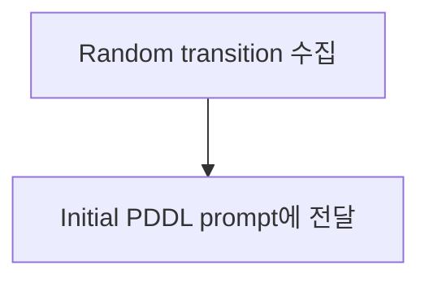
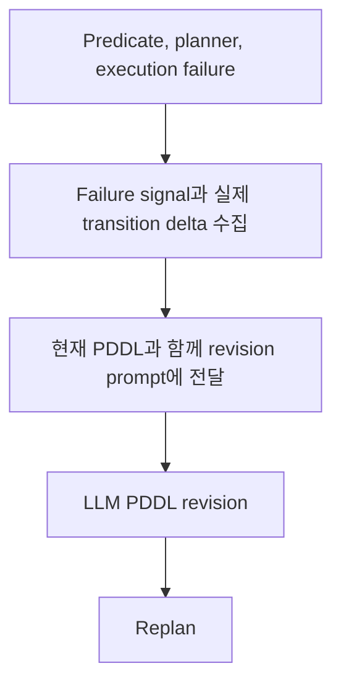

# TC2 v1/v2 변경 요소

## v1 — Initial PDDL Grounding

```mermaid
graph TD
    A["Random transition 수집"]
    A --> B["Initial PDDL prompt에 전달"]
```

## v2 — Failure-Driven PDDL Revision

```mermaid
graph TD
    A["Predicate, planner, execution failure"]
    A --> B["Failure signal과 실제 transition delta 수집"]
    B --> C["현재 PDDL과 함께 revision prompt에 전달"]
    C --> D["LLM PDDL revision"]
    D --> E["Replan"]
```
